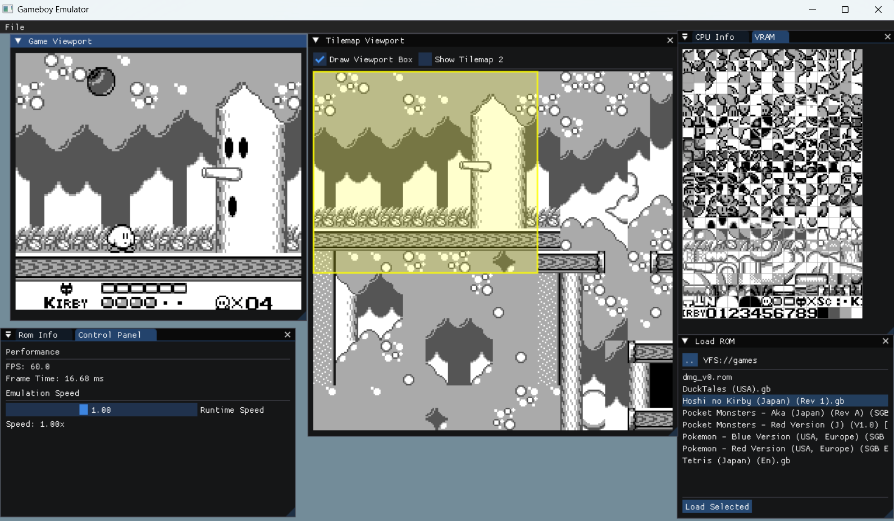

# FeelsEmuGB
Let's see where this learning project takes us!  
I want to get the core features in first, before focusing on accuracy.  
Goal: Help others (and myself!) better understand the architecture of the Game Boy.

 

🚧 Work in Progress 🚧  
To do list - GB  
ROM Banking / MBCs: MBC1✅, the rest not yet  
RAM Saving  
Audio  
Pass the other tests  
Joypad hardware interrupts

To do list - Editor features  
Tilemap visualizer ✅  
Save states  
Palette editor / visualizer  
Input remappping  
Practice writing shaders for things like a scanline effect  

Status:  
CPU - Blargg's test roms - cpu_instrs all passed ✅  
Input: D-pad (WASD), Select/Start(ZX), B/A(JK)  
MBCs: ROM-only, MBC1

To build: Just run setup.bat, or cmake on the root directory. Hopefully will work. Tried to make it as hassle-free as possible. Requires CMake.
