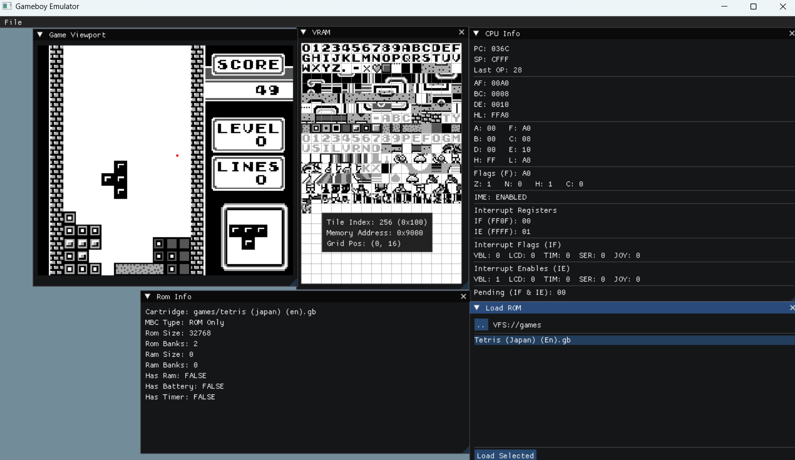

# FeelsEmuGB
Let's see where this learning project takes us!
I want to get the core features in first, before focusing on accuracy.

🚧 Work in Progress 🚧
To do list - GB:
ROM Banking / MBCs
Audio
Pass the other tests
Joypad hardware interrupts
Graphics - Priority checks, cycle inaccuracies related to PPU drawing and DMA transfer.

To do list - Editor features
Tilemap visualizer
Palette editor / visualizer
Input remappping
Save states
Practice writing shaders for things like a scanline effect

Status:
CPU - Blargg's test roms - cpu_instrs all passed ✅
Input: D-pad (WASD), Select/Start(ZX), B/A(JK)
MBCs: Only ROM-only

Goal: Help others (and myself!) better understand the architecture of the Game Boy.

To build: Just run setup.bat, or cmake on the root directory. Hopefully will work. Tried to make it as hassle-free as possible. Requires CMake.
