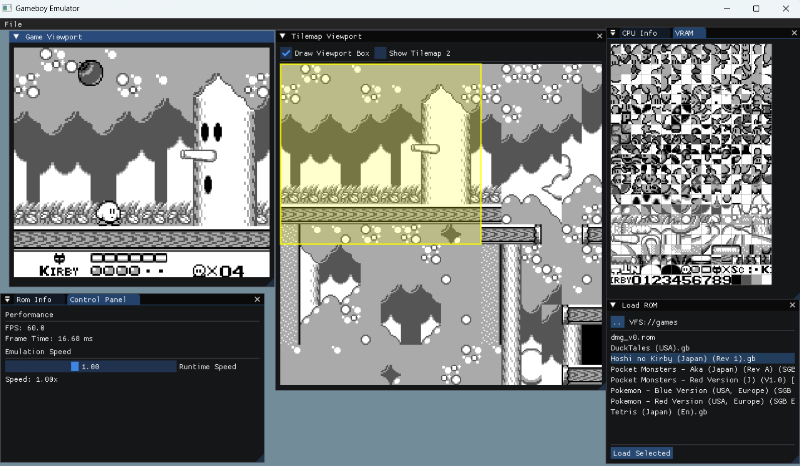
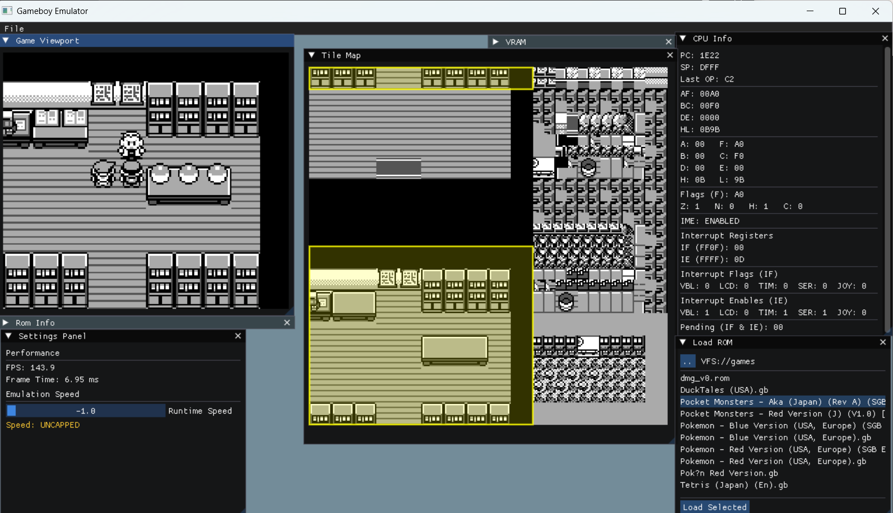

# FeelsEmuGB
Let's see where this project takes us!  
I want to get the core features in first, before focusing on accuracy.  
Goal: Help others (and myself!) better understand the architecture of the Game Boy.

 

🚧 Work in Progress 🚧  
To do list - GB  
ROM Banking / MBCs: MBC1, MBC3 (w/o RTC), MBC5 ✅  
RAM Saving ✅  
Audio ✅  
Compiling to Web ✅  
GBC Support  
Accuracy Improvements  

To do list - Editor features  
Tilemap visualizer ✅  
Save states ✅  
Palette editor / visualizer  
Input remappping  
Practice writing shaders for things like a scanline effect  

Input:  
D-pad (WASD), Select/Start(ZX), B/A(JK)  

To build:  
Requires CMake.  
Just run setup.bat, or cmake on the root directory. Hopefully will work. *Put your roms in the roms/ folder.* I will fix this...  